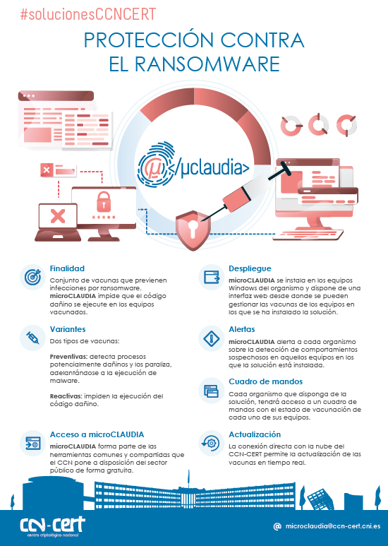
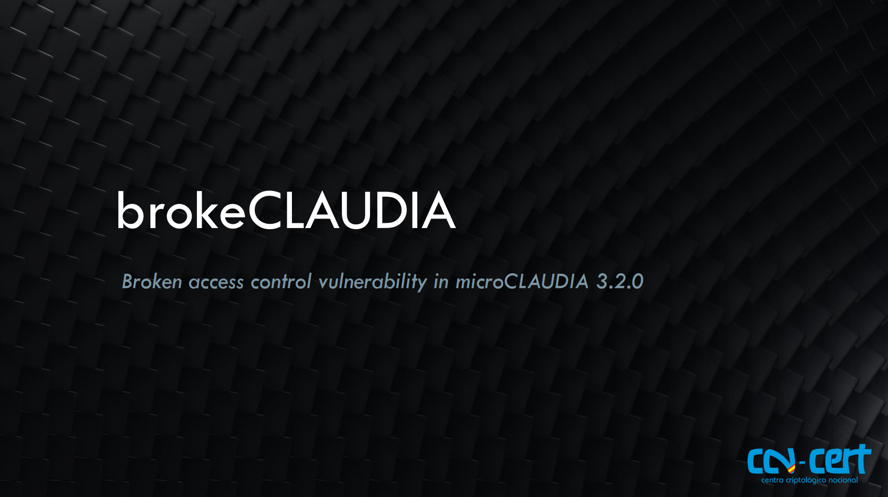
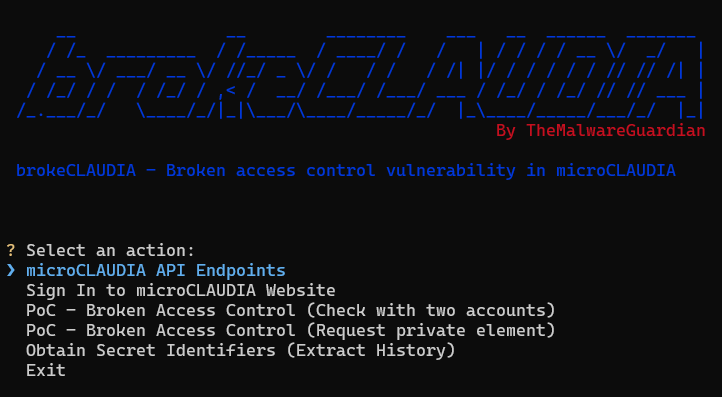

# ***🔓 brokeCLAUDIA***


<p align="center">

<i>Broken access control vulnerability in microCLAUDIA</i>
</p>


---
---
---


## ***📑 Table of Contents***

<ul>
	<li><a href="#microclaudia">What is microCLAUDIA?</a></li>
	<li><a href="#vulnerability">Vulnerability</a></li>
<details>
	<summary>📂</summary>
	<ul>
		<li><a href="#vulnerability-brokenaccesscontrol">Broken Access Control</a></li>
		<li><a href="#vulnerability-remediation">Remediation</a></li>
		<li><a href="#vulnerability-presentation">Presentation</a></li>
	</ul>
</details>
	<li><a href="#exploit">Exploit</a></li>
<details>
	<summary>📂</summary>
	<ul>
		<li><a href="#exploit-overview">Overview</a></li>
		<li><a href="#exploit-requirements">Requirements</a></li>
		<li><a href="#exploit-installation">Installation</a></li>
		<li><a href="#exploit-usage">Usage</a></li>
	</ul>
</details>
	<li><a href="#notes">Notes</a></li>
	<li><a href="#references">References</a></li>
</ul>


---
---
---


<div id='microclaudia'/>

## ***🧠 What is microCLAUDIA***

[microCLAUDIA](https://www.ccn-cert.cni.es/en/tools/microclaudia-en.html) is a [CLAUDIA](https://www.ccn-cert.cni.es/en/tools/claudia-en.html) engine based capability that provides protection against harmful ransomware code to an organization's equipment. It does this by using a lightweight agent for Windows systems that handles vaccine deployment and execution.

The connection of the agent to the [microCLAUDIA central service](https://microclaudia.ccn-cert.cni.es/), located in the CCN-CERT cloud, enables the download and execution of the vaccines that the organism has configured for its computers. Once downloaded, the agent does not require connectivity to the cloud for its execution or a central service or server installed in the organism. Likewise, the service offers automatic updating of these vaccines to cover adaptations to new ways of running ransomware.

On the other hand, the CCN-CERT administers the central service in its cloud and is responsible for the generation of new vaccines, allowing the agency to access this service and, in this way, review the general state of vaccination of its equipment and even configure its application.

microCLAUDIA can be [deployed](https://github.com/TheMalwareGuardian/brokeCLAUDIA/blob/main/Manuals/microclaudia%20-%20manual%20de%20usuario.pdf) from any software distribution management tool or through Windows policies. In addition, it does not need additional modifications in the organism's network.

<p align="center">

</p>


---
---
---


<div id='vulnerability'/>

## ***🐞 Vulnerability***


<div id='vulnerability-brokenaccesscontrol'/>

### ***🚫 Broken Access Control***

[Broken access control](https://owasp.org/www-community/Broken_Access_Control ) vulnerabilities exist when a user can access resources or perform actions that they are not supposed to be able to.

In version 3.2.0 and earlier versions of microCLAUDIA, there is a broken access control vulnerability (brokeCLAUDIA) that allows an attacker who has previously gained access to an account to access or modify data from other organizations not associated with the user.

In other words, the attacker could manipulate information from organizations that are not directly related to the compromised account.

To successfully exploit this vulnerability, it's crucial to grasp the following key aspects:

- The attacker needs to obtain the identifiers associated with those organizations to perform the unauthorized actions.
- The vulnerability exists only when making requests through the API, not through the web interface.
- The identifiers used in web requests are transmitted in the URL, which poses a risk if an attacker gains access to the identifiers by dumping the history of a compromised machine.
- The manager role grants the ability to modify data (activate/deactivate vaccines, install/uninstall agents, etc.).


<div id='vulnerability-remediation'/>

### ***🛠️ Remediation***

In order to remediate the broken access control vulnerability identified in microCLAUDIA, it is essential to implement several key measures. First and foremost, it is imperative to enhance API controls to prevent unauthorized access to information. Implement checks to ensure that direct access to data is restricted, and enforce verification processes to confirm the association of the user with the organization before granting access.

Moreover, it is crucial to address the specific security concern related to the transmission of identifiers in GET requests. This entails ensuring that identifiers vital for the main functionality are not transmitted in a manner that exposes them. Adopting secure methods of transmission is highly recommended to fortify this aspect of microCLAUDIA's security architecture.

By diligently implementing these measures, the identified broken access control vulnerability in microCLAUDIA can be effectively mitigated. The combination of enhanced API controls and secure data transmission practices forms a robust defense, significantly reducing the risk of unauthorized access and manipulation of sensitive information.


<div id='vulnerability-presentation'/>

### ***🖥️ Presentation***

You can find the original presentation materials below:

- [PowerPoint](https://github.com/TheMalwareGuardian/brokeCLAUDIA/blob/main/Presentation/CVE_brokeCLAUDIA_Presentation.pptx)
- [PDF](https://github.com/TheMalwareGuardian/brokeCLAUDIA/blob/main/Presentation/CVE_brokeCLAUDIA_Presentation.pdf)

<p align="center">

</p>

---
---
---


<div id='exploit'/>

## ***💥 Exploit***


<div id='exploit-overview'/>

### ***🧾 Overview***

A python script specifically developed to detect the presence of a broken access control vulnerability in microCLAUDIA.


<div id='exploit-requirements'/>

### ***📦 Requirements***

- [microCLAUDIA account (email and password)](https://microclaudia.ccn-cert.cni.es/)
- [Python3](https://www.python.org/)


<div id='exploit-installation'/>

### ***🧰 Installation***

```
git clone https://github.com/TheMalwareGuardian/brokeCLAUDIA
cd brokeCLAUDIA
python -m venv venv
pip3 install -r requirements.txt
source venv/bin/activate or venv\Scripts\activate
```


<div id='exploit-usage'/>

### ***▶️ Usage***

```
python main.py
```

Watch the tool in action here: [📺 View Demo](https://github.com/TheMalwareGuardian/brokeCLAUDIA/blob/main/Videos/Tool.mp4)

<p align="center">

</p>


---
---
---


<div id='notes'/>

## ***🗒️ Notes***

* *It's important to note that the first identification of this flaw, or at least when the repository was created, dates back to version 2.16.3.*
* *The initial report concerning the existence of this vulnerability was sent to the National Cryptologic Center's (CCN) incident account, incidentes@ccn-cert.cni.es, on Monday, March 11th, 2024 at 5:54 PM.*
* *The tool/script was last used in March 2024 to verify the presence of the vulnerability, specifically on microCLAUDIA version 3.2.0.*
* *microCLAUDIA version 3.2.2 includes a fix for the vulnerability.*
* *As of version 3.6.1, the vulnerability remains fully patched. A prudent amount of time has passed since responsible disclosure, and no further exposure has been observed. Therefore, this information can now be published safely.*


---
---
---


<div id='references'/>

## ***🔗 References***

- [Web CCN-Cert/CNI: microCLAUDIA Anti-Ransomware](https://www.ccn-cert.cni.es/en/tools/microclaudia-en.html)
- [Web OWASP: Broken Access Control](https://owasp.org/www-community/Broken_Access_Control )
- [Web OWASP Top10: A01 - Broken Access Control](https://owasp.org/Top10/A01_2021-Broken_Access_Control/)
- [Web PortSwigger: Access control vulnerabilities and privilege escalation](https://portswigger.net/web-security/access-control)
- [Web EC-Council: What Is Broken Access Control Vulnerability?](https://www.eccouncil.org/cybersecurity-exchange/web-application-hacking/broken-access-control-vulnerability/)
